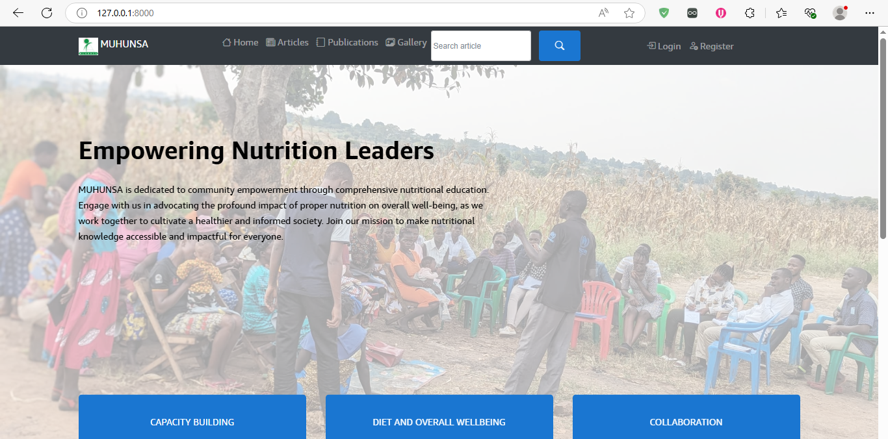
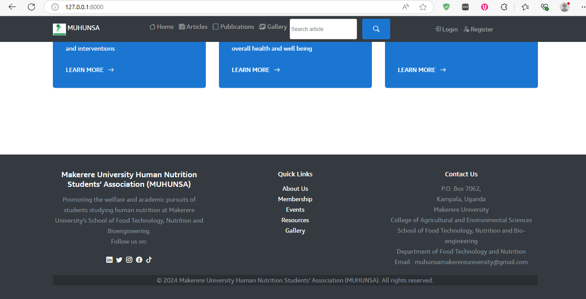
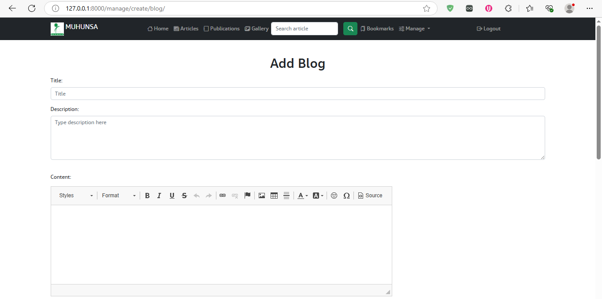
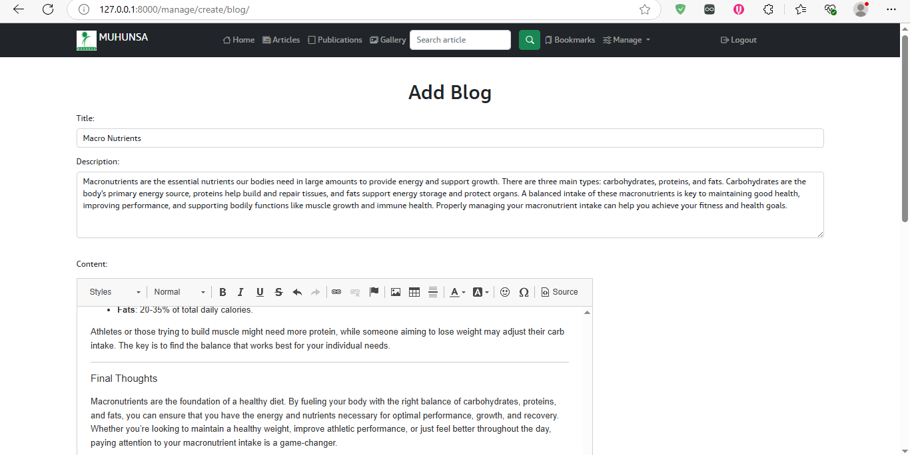
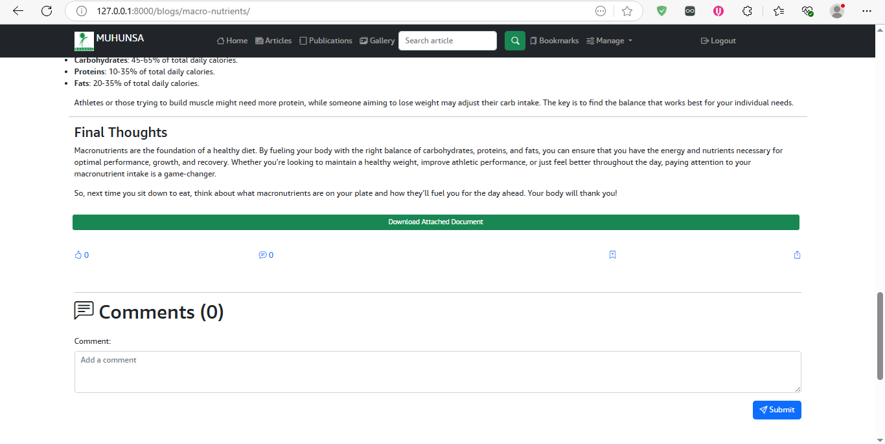
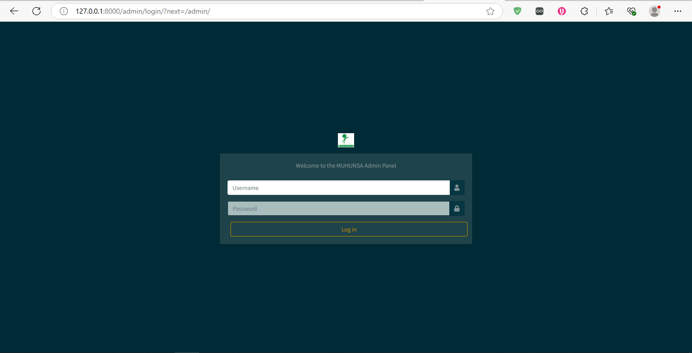
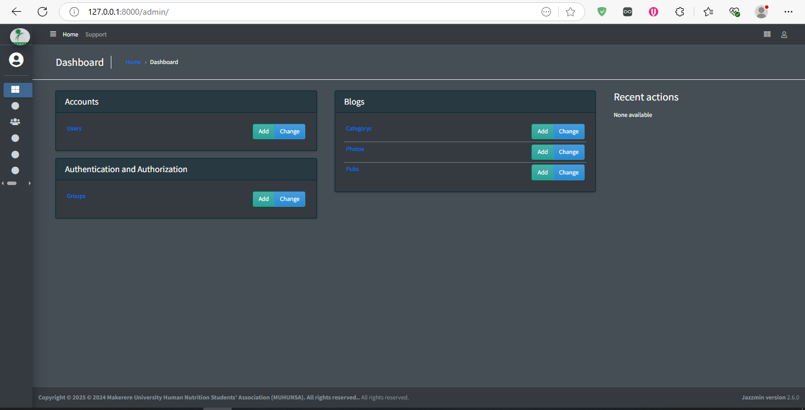
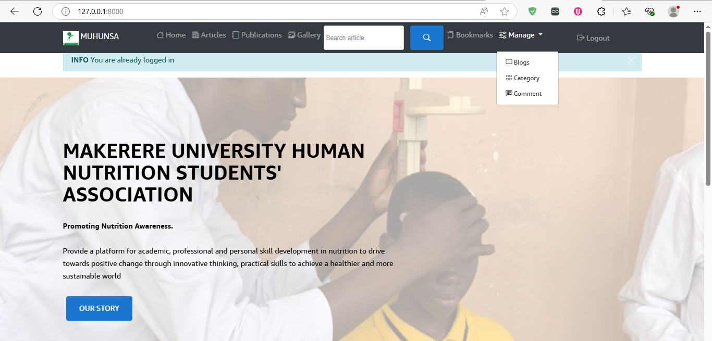

# MAKERERE UNIVERSITY HUMAN NUTRITION STUDENTS' ASSOCIATION (MUHUNSA) BLOG SITE

The MUHUNSA Blog Site is a dynamic and feature-rich Django application created for the students and members of the Makerere University Human Nutrition Students' Association. This platform provides an engaging space for sharing knowledge, insights, and updates on topics related to human nutrition. The site allows users to create, manage, and interact with blogs through features like commenting, liking, and bookmarking. Additionally, users can explore photo galleries and publications that highlight important topics in the field. The blog site also integrates a secure user authentication system and an easy-to-use admin panel for efficient content management.

 
 

## Features

### 1. **Blog Management**
- **Create, Edit, Delete Blogs**: Full functionality for creating and managing blogs.
- **Categories**: Organize blogs with categories for easy filtering.
- **PDF Uploads**: Attach PDFs to blog posts.
- **Blog Views**: Track engagement with view counts.

  <!-- Add blog management screenshot -->
Create a Blog

Edit a Blog

### 2. **User Authentication**
- **User Registration/Login**: Secure account creation and management.
- **Password Reset**: Reset passwords via email.

### 3. **User Interaction**
- **Commenting & Replies**: Engage with posts and other users.
- **Likes & Bookmarks**: Like posts and save them for later.

  <!-- Add interaction screenshot -->

### 4. **Admin Panel**
- **Content Management**: Manage categories, blogs, comments, and users.
- **Moderation**: Approve or delete comments and users.

  <!-
 - Add admin panel screenshot -->
 

### 5. **Photo Gallery**
- **Upload/View Photos**: Add images to blogs and browse galleries.

### 6. **Publications**
- **Manage Publications**: Link research papers or whitepapers to blogs.

## Technologies Used

- **Backend**: Django 4.x
- **Frontend**: HTML5, CSS3, JavaScript
- **Database**: SQLite (or any Django-supported relational database)
- **Authentication**: Django’s built-in system
- **Storage**: Local file system for PDFs/images

## Installation

### 1. Clone the Repository

```bash
git clone https://github.com/yourusername/django-blog.git
cd django-blog


### 2. Set Up a Virtual Environment
```bash
python3 -m venv venv
```

Activate the environment:

- **macOS/Linux**:
  ```bash
  source venv/bin/activate
  ```

- **Windows**:
  ```bash
  venv\Scripts\activate
  ```

### 3. Install Dependencies
```bash
pip install -r requirements.txt
```

### 4. Set Up the Database
```bash
python manage.py migrate
```

### 5. Create a Superuser
```bash
python manage.py createsuperuser
```

### 6. Run the Development Server
```bash
python manage.py runserver
```

Access the app at `http://127.0.0.1:8000/`.

## Usage

### Admin Panel
1. Visit `http://127.0.0.1:8000/admin`.
2. Log in with your superuser credentials.
3. Manage content, users, and categories.

### Creating Blogs
1. Log in and click **Create Blog**.
2. Fill in details, upload a PDF (optional), and publish.

### Interacting with Blogs
- **Comments/Replies**: Engage in discussions.
- **Likes/Bookmarks**: Show appreciation or save posts.

### Admin Tasks
- **Moderate Content**: Approve/delete blogs, comments, and users.
- **Manage Photos**: Upload or remove images.

## Contributing
1. **Fork** the repository.
2. **Clone** your fork:
   ```bash
   git clone https://github.com/mar-vyn23/MUHUNSA.git
   ```
3. **Create a Branch**:
   ```bash
   git checkout -b feature-branch
   ```
4. **Commit Changes**:
   ```bash
   git commit -am 'Add new feature'
   ```
5. **Push** to your fork:
   ```bash
   git push origin feature-branch
   ```
6. **Open a Pull Request** on the main repository.

## License
MIT License. See [LICENSE](LICENSE) for details.

## Contact
- **Email**: marvovybes23@gmail.com
- **GitHub**: [https://github.com/mar-vyn23/MUHUNSA](https://github.com/mar-vyn23/MUHUNSA)

## Acknowledgments
- Django community for the fantastic framework.
- [FontAwesome](https://fontawesome.com/) for icons.
``` 

